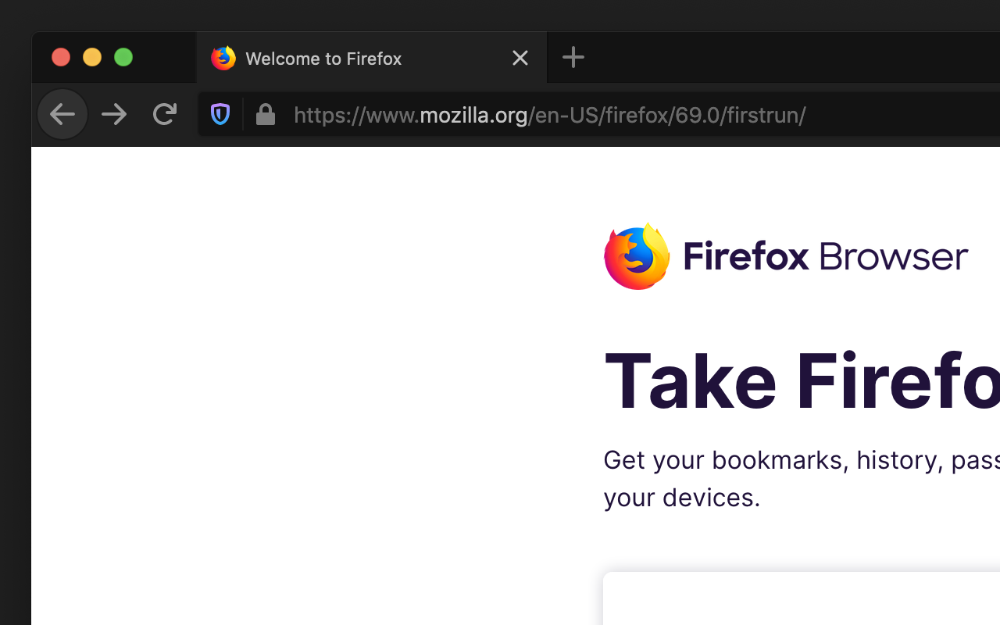
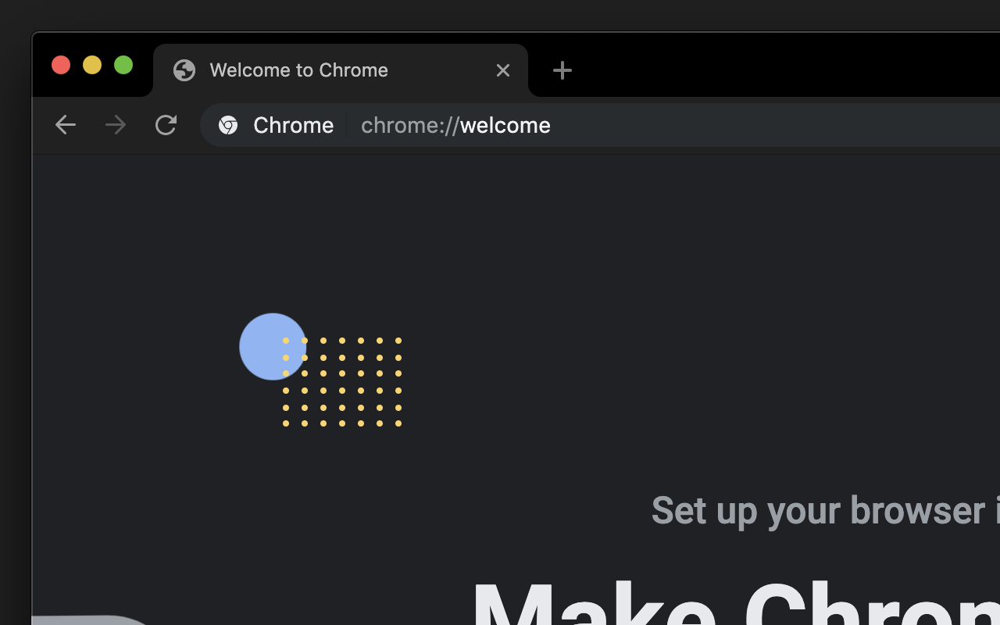
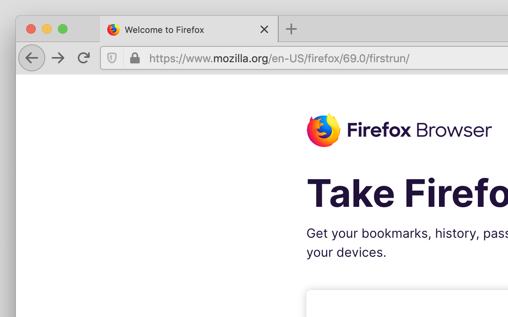
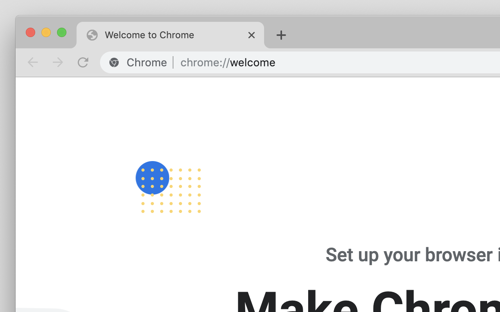

	

<h1 align="center">
	Matched
</h1>

	A set of simple, low contrast light/dark themes

---

# Auto

Follow system colorscheme.

[Firefox](https://addons.mozilla.org/en-US/firefox/addon/auto-matched/)

# Dark

<table>
	<thead>
		<tr>
			<th>Firefox</th>
			<th>Chrome</th>
		</tr>
	</thead>
	<tbody>
		<tr>
			<td>
				
			</td>
			<td>
				
			</td>
		</tr>
	</tbody>
</table>

# Light

<table>
	<thead>
		<tr>
			<th>Firefox</th>
			<th>Chrome</th>
		</tr>
	</thead>
	<tbody>
		<tr>
			<td>
				
			</td>
			<td>
				
			</td>
		</tr>
	</tbody>
</table>
