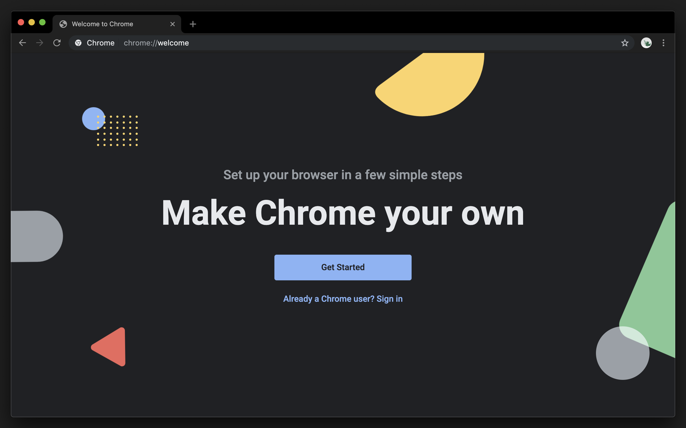
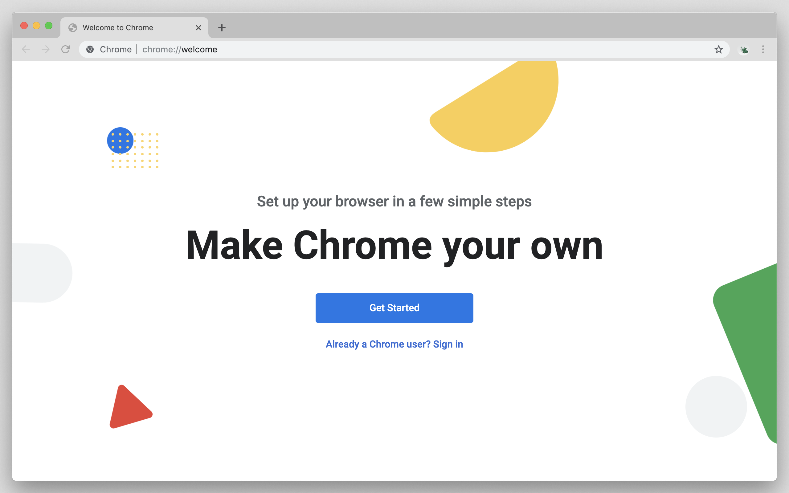

	

<h1 align="center">
	Matched
</h1>

	A set of simple, low contrast light/dark themes

---

# Auto

Follow system colorscheme.

[Firefox](https://addons.mozilla.org/en-US/firefox/addon/auto-matched/)

# Dark

[Firefox](https://addons.mozilla.org/en-US/firefox/addon/dark-matched/)
[Chrome](https://chrome.google.com/webstore/detail/dark-matched/aapflpcfdelmkobdakjnieeaoiofcodk)

# Light

[Firefox](https://addons.mozilla.org/en-US/firefox/addon/dark-matched/)
[Chrome](https://chrome.google.com/webstore/detail/light-matched/bilibfhhkphlgndmckcabgpbanadpnbj)
