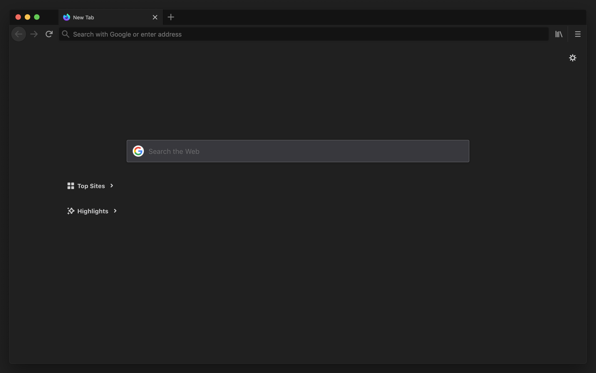

	

<h1 align="center">
	Matched
</h1>

	A set of simple, low contrast light/dark themes

---

# Auto

Follow system colorscheme.

[Firefox](https://addons.mozilla.org/en-US/firefox/addon/auto-matched/)

# Dark

# Light

